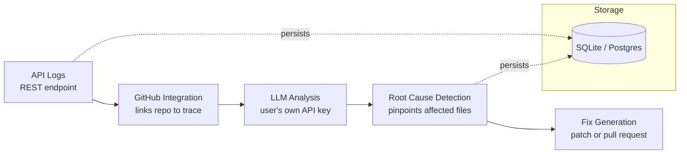
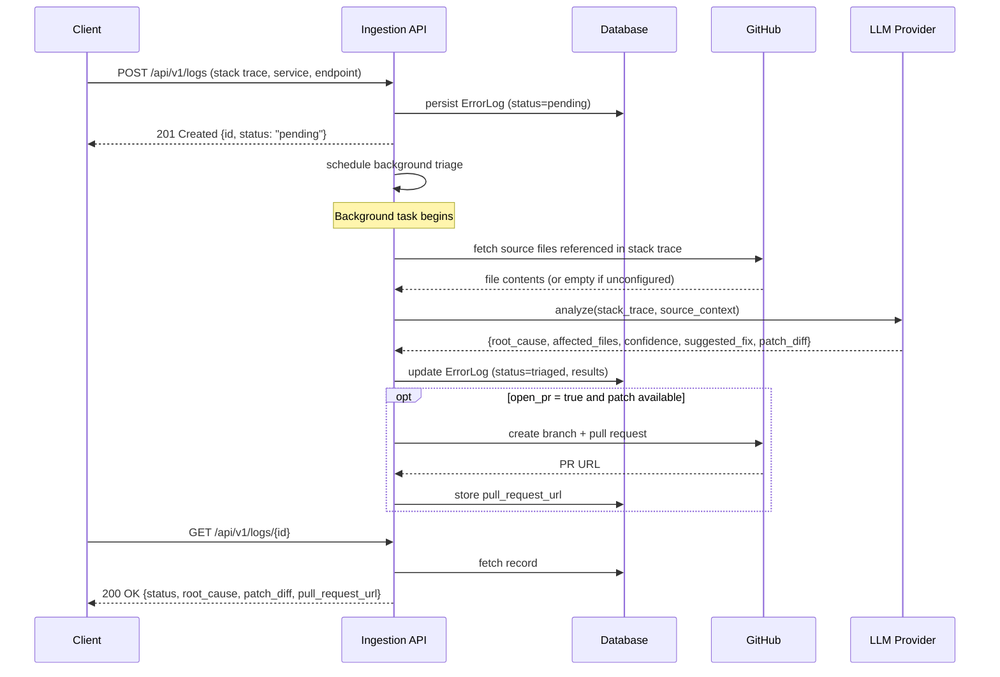

# AutoTriage

Agentless API observability platform that automatically investigates backend errors and generates code-level fixes.

Backend teams lose hours tracing API failures across scattered logs and source code. When an error hits production, engineers manually correlate stack traces with the codebase, guess the root cause, and hand-write a fix. AutoTriage removes that manual step: send it a structured error log, and it ingests the trace, pulls the relevant source from GitHub, runs LLM-based root-cause analysis, and returns a deploy-ready patch or opens a pull request — with no SDK or sidecar installed on the target system, just a single ingestion endpoint.

## Table of Contents

- [Architecture](#architecture)
- [Request Lifecycle](#request-lifecycle)
- [Tech Stack](#tech-stack)
- [Setup & Installation](#setup--installation)
- [API Documentation](#api-documentation)
- [Local Development](#local-development)
- [Limitations](#limitations)
- [Further Docs](#further-docs)
- [License](#license)
- [Contributing](#contributing)

## Architecture



Each error log flows through the pipeline once: ingestion validates and stores it, GitHub integration resolves the files referenced in the stack trace, the LLM layer reasons about root cause using that source context, and the fix-generation stage turns the LLM's suggestion into a diff and, optionally, a pull request.

## Request Lifecycle



## Tech Stack

| Component | Technology | Reason |
|---|---|---|
| API framework | FastAPI | Async-friendly, automatic OpenAPI docs, strong typing via Pydantic |
| Data validation | Pydantic v2 | Strict request/response schemas, clear 422 errors on malformed logs |
| Database | SQLAlchemy + SQLite (dev) | Zero-setup local development; swaps to Postgres via `DATABASE_URL` with no code changes |
| GitHub integration | PyGithub | Mature wrapper over the GitHub REST API for content reads and PR creation |
| LLM layer | OpenAI SDK / Anthropic SDK behind a common interface | Provider-agnostic — the caller supplies their own key, AutoTriage never bundles LLM cost |
| Background execution | FastAPI `BackgroundTasks` | Keeps ingestion fast; triage (the slow LLM call) runs after the response is sent |
| Containerization | Docker + docker-compose | One-command local run, consistent environment |

## Setup & Installation

### Prerequisites

- Python 3.11+
- A GitHub Personal Access Token (PAT) with `repo` scope — [generate one here](https://github.com/settings/tokens) — needed only if you want AutoTriage to read your source and open PRs. Without it, triage still runs but with no source context.
- An API key from OpenAI or Anthropic — AutoTriage does not include or subsidize LLM usage; you use your own key and pay your own provider directly.

### Steps

1. **Clone and enter the repo**
   ```bash
   git clone https://github.com/SabarishR08/autotriage.git
   cd autotriage
   ```

2. **Create a virtual environment and install dependencies**
   ```bash
   python -m venv .venv
   source .venv/bin/activate   # Windows: .venv\Scripts\activate
   pip install -r requirements.txt
   ```

3. **Configure environment variables**
   ```bash
   cp .env.example .env
   ```
   Fill in:
   - `GITHUB_TOKEN` — your PAT
   - `GITHUB_REPO` — the repo AutoTriage should correlate errors against, format `owner/repo`
   - `LLM_PROVIDER` — `openai` or `anthropic`
   - `LLM_API_KEY` — your provider's API key
   - `LLM_MODEL` — defaults to `claude-sonnet-4-6`, override as needed

4. **Run the server**
   ```bash
   uvicorn app.main:app --reload
   ```
   The API is now live at `http://localhost:8000`. Interactive OpenAPI docs (auto-generated by FastAPI) are at `http://localhost:8000/docs`.

### Docker (alternative)

```bash
docker-compose up --build
```

## API Documentation

### `POST /api/v1/logs`

Ingest a structured error log. Triage runs asynchronously in the background.

**Request body**

```json
{
  "service_name": "checkout-api",
  "endpoint": "POST /v1/orders",
  "stack_trace": "Traceback (most recent call last):\n  File \"app/services/orders.py\", line 42, in create_order\n    total = calculate_total(items)\nZeroDivisionError: division by zero",
  "occurred_at": "2026-08-16T10:00:00Z",
  "request_metadata": {
    "user_id": "u_123",
    "cart_size": 0
  }
}
```

**Response — `201 Created`**

```json
{
  "id": "ac6be0d1-6673-466a-828c-9563561b2df5",
  "status": "pending",
  "message": "Log ingested. Triage is running in the background."
}
```

**Errors**

| Code | Cause |
|---|---|
| `422` | Missing or malformed required fields (`service_name`, `endpoint`, `stack_trace`, `occurred_at`) |

---

### `GET /api/v1/logs/{log_id}`

Fetch the current status and triage results for a single error log.

**Response — `200 OK`**

```json
{
  "id": "ac6be0d1-6673-466a-828c-9563561b2df5",
  "service_name": "checkout-api",
  "endpoint": "POST /v1/orders",
  "status": "triaged",
  "root_cause": "calculate_total divides by cart item count without checking for zero items.",
  "affected_files": ["app/services/orders.py"],
  "confidence": "high",
  "suggested_fix": "Add a guard clause returning 0 when items is empty before dividing.",
  "patch_diff": "--- a/app/services/orders.py\n+++ b/app/services/orders.py\n@@ -40,6 +40,8 @@\n def calculate_total(items):\n+    if not items:\n+        return 0\n     return sum(i.price for i in items) / len(items)",
  "pull_request_url": null,
  "error_detail": null,
  "occurred_at": "2026-08-16T10:00:00Z",
  "received_at": "2026-08-16T10:00:01Z"
}
```

**Errors**

| Code | Cause |
|---|---|
| `404` | No log exists with the given `log_id` |

---

### `GET /api/v1/logs`

List ingested logs, optionally filtered by status.

**Query parameters**

| Param | Type | Default | Description |
|---|---|---|---|
| `status` | string | none | Filter by `pending`, `analyzing`, `triaged`, or `failed` |
| `limit` | int | 50 | Max records to return |
| `offset` | int | 0 | Pagination offset |

**Response — `200 OK`**

```json
{
  "total": 2,
  "items": [ { "...": "TriageResult objects, newest first" } ]
}
```

---

### `POST /api/v1/logs/{log_id}/retriage`

Re-run triage synchronously for an existing log. Useful for demos and debugging — returns the full result immediately instead of polling.

**Query parameters**

| Param | Type | Default | Description |
|---|---|---|---|
| `open_pr` | bool | false | If true and a patch is generated, opens a pull request on the configured repo |

**Response — `200 OK`**: same shape as `GET /api/v1/logs/{log_id}`.

**Errors**

| Code | Cause |
|---|---|
| `404` | No log exists with the given `log_id` |

---

### `GET /health`

Liveness and configuration check.

```json
{
  "status": "ok",
  "app": "AutoTriage",
  "env": "development",
  "llm_provider": "anthropic",
  "github_configured": true
}
```

## Local Development

**Run tests:**
```bash
pytest tests/ -v
```

**Run with auto-reload:**
```bash
uvicorn app.main:app --reload
```

**Seed a sample error** (once the server is running):
```bash
curl -X POST http://localhost:8000/api/v1/logs \
  -H "Content-Type: application/json" \
  -d '{
    "service_name": "checkout-api",
    "endpoint": "POST /v1/orders",
    "stack_trace": "File \"app/services/orders.py\", line 42, in create_order\nZeroDivisionError: division by zero",
    "occurred_at": "2026-08-16T10:00:00Z"
  }'
```

Then poll `GET /api/v1/logs/{id}` for the triage result.

## Limitations

- Requires a valid user-provided LLM API key — no key, no root-cause analysis.
- GitHub repo access (read + PR-create permissions) is required to map stack traces to actual source; without it, triage runs on the stack trace alone.
- Log format must be structured JSON at ingestion — malformed or unstructured logs reduce fix accuracy.
- Rate limits on the LLM provider or GitHub API can throttle triage speed during high error volume.
- Automated PR branch creation assumes a `main` base branch by default (configurable).

## Further Docs

- [`docs/ARCHITECTURE.md`](docs/ARCHITECTURE.md) — component responsibilities, data flow, and design decisions.

## License

MIT — see [LICENSE](LICENSE).

## Contributing

Issues and pull requests are welcome. Please open an issue describing the change before submitting a large PR.
