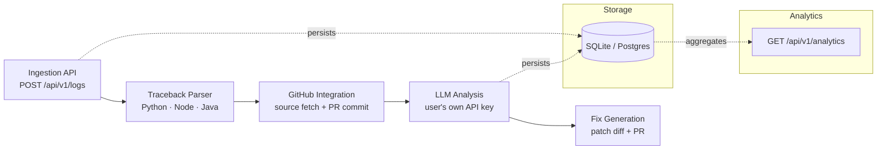
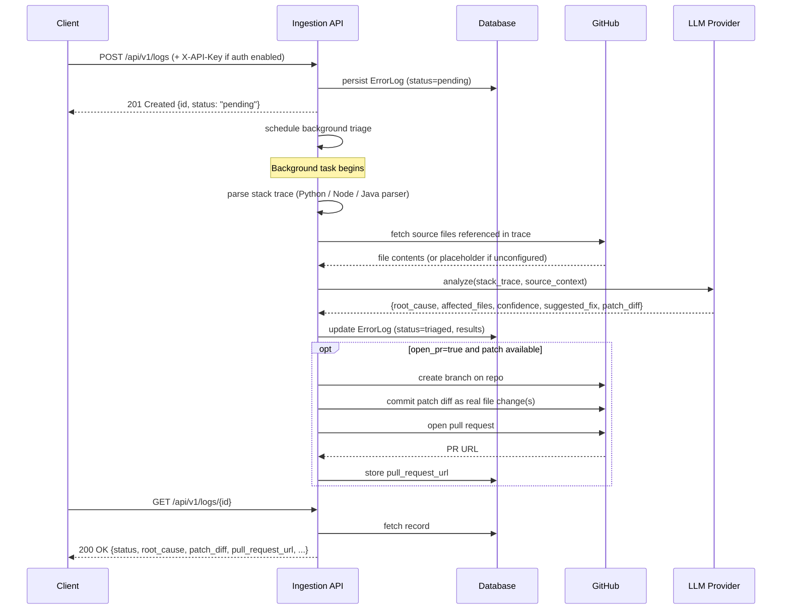

# AutoTriage

Agentless API observability platform that automatically investigates backend errors and generates code-level fixes.

Backend teams lose hours tracing API failures across scattered logs and source code. AutoTriage removes that manual step: send it a structured error log, and it ingests the trace, pulls the relevant source from GitHub, runs LLM-based root-cause analysis, and returns a deploy-ready patch — or commits the fix directly to a branch and opens a pull request — with no SDK or sidecar installed on the target system.

## Table of Contents

- [Architecture](#architecture)
- [Request Lifecycle](#request-lifecycle)
- [Tech Stack](#tech-stack)
- [Setup & Installation](#setup--installation)
- [API Documentation](#api-documentation)
- [Local Development](#local-development)
- [Limitations](#limitations)
- [Further Docs](#further-docs)
- [License](#license)

## Architecture



Each error log flows through the pipeline once: ingestion validates and stores it, the traceback parser extracts source file paths, GitHub integration fetches real source context, the LLM reasons about root cause, and the fix stage commits the diff to a new branch before opening a PR.

## Request Lifecycle



## Tech Stack

| Component | Technology | Reason |
|---|---|---|
| API framework | FastAPI | Async-friendly, automatic OpenAPI docs, strong typing via Pydantic |
| Data validation | Pydantic v2 | Strict request/response schemas, clear 422 errors on malformed logs |
| Database | SQLAlchemy + SQLite (dev) | Zero-setup local dev; swap to Postgres via `DATABASE_URL` with no code changes |
| GitHub integration | PyGithub | Mature GitHub REST API wrapper for content reads, branch/commit/PR creation |
| LLM layer | OpenAI SDK / Anthropic SDK | Provider-agnostic — caller supplies their own key; Groq and NVIDIA NIM work via `OPENAI_API_BASE` |
| Background execution | FastAPI `BackgroundTasks` | Keeps ingestion fast; slow LLM call runs after the response is sent |
| Containerization | Docker + docker-compose | One-command local run |

## Setup & Installation

### Prerequisites

- Python 3.11+
- A GitHub fine-grained PAT with **Contents: read/write** and **Pull requests: read/write** on the target repo — [generate one here](https://github.com/settings/personal-access-tokens/new). Without it, triage still runs but with no source context and no PR creation.
- An API key from OpenAI, Anthropic, Groq, or any OpenAI-compatible provider. AutoTriage never bundles LLM cost — you use your own key.

### Steps

1. **Clone and enter the repo**
   ```bash
   git clone https://github.com/SabarishR08/autotriage.git
   cd autotriage
   ```

2. **Create a virtual environment and install dependencies**
   ```bash
   python -m venv .venv
   source .venv/bin/activate   # Windows: .venv\Scripts\activate
   pip install -r requirements.txt
   ```

3. **Configure environment variables**
   ```bash
   cp .env.example .env
   ```
   Key variables:

   | Variable | Required | Description |
   |---|---|---|
   | `GITHUB_TOKEN` | Recommended | Fine-grained PAT for source fetch + PR creation |
   | `GITHUB_REPO` | Recommended | `owner/repo` to correlate errors against |
   | `LLM_PROVIDER` | Yes | `openai` or `anthropic` |
   | `LLM_API_KEY` | Yes | Your provider's API key |
   | `LLM_MODEL` | No | Defaults to `claude-sonnet-4-6`; override as needed |
   | `OPENAI_API_BASE` | No | Custom base URL — enables Groq (`https://api.groq.com/openai/v1`) or NVIDIA NIM |
   | `AUTOTRIAGE_API_KEY` | No | Set to require `X-API-Key` header on `POST /api/v1/logs` |

4. **Run the server**
   ```bash
   uvicorn app.main:app --reload
   ```
   API: `http://localhost:8000` — Interactive docs: `http://localhost:8000/docs`

### Docker (alternative)

```bash
docker-compose up --build
```

## API Documentation

### `POST /api/v1/logs`

Ingest a structured error log. Triage runs asynchronously; poll `GET /api/v1/logs/{id}` for results.

When `AUTOTRIAGE_API_KEY` is set, include the header `X-API-Key: <your-key>` or the request is rejected with `401`.

**Request body**

```json
{
  "service_name": "checkout-api",
  "endpoint": "POST /v1/orders",
  "stack_trace": "Traceback (most recent call last):\n  File \"app/services/orders.py\", line 42, in create_order\n    total = calculate_total(items)\nZeroDivisionError: division by zero",
  "occurred_at": "2026-08-16T10:00:00Z",
  "request_metadata": { "user_id": "u_123", "cart_size": 0 }
}
```

**Response — `201 Created`**

```json
{
  "id": "ac6be0d1-6673-466a-828c-9563561b2df5",
  "status": "pending",
  "message": "Log ingested. Triage is running in the background."
}
```

| Code | Cause |
|---|---|
| `401` | Missing or wrong `X-API-Key` (only when `AUTOTRIAGE_API_KEY` is set) |
| `422` | Missing or malformed required fields |

---

### `GET /api/v1/logs/{log_id}`

Fetch current status and triage results for a single log.

**Response — `200 OK`**

```json
{
  "id": "ac6be0d1-...",
  "service_name": "checkout-api",
  "endpoint": "POST /v1/orders",
  "status": "triaged",
  "root_cause": "calculate_total divides by item count without checking for empty list.",
  "affected_files": ["app/utils/math.py"],
  "confidence": "high",
  "suggested_fix": "Add a guard clause before the division.",
  "patch_diff": "--- app/utils/math.py\n+++ app/utils/math.py\n@@ -1,3 +1,5 @@\n def calculate_total(items):\n+    if not items:\n+        raise ValueError('empty')\n     return sum(i['price'] for i in items) / len(items)",
  "pull_request_url": "https://github.com/owner/repo/pull/1",
  "error_detail": null,
  "occurred_at": "2026-08-16T10:00:00Z",
  "received_at": "2026-08-16T10:00:01Z"
}
```

| Code | Cause |
|---|---|
| `404` | No log with given `log_id` |

---

### `GET /api/v1/logs`

List logs with optional filters.

| Param | Type | Default | Description |
|---|---|---|---|
| `status` | string | — | Filter by `pending` / `analyzing` / `triaged` / `failed` |
| `service` | string | — | Filter by `service_name` |
| `limit` | int | 50 | Max records |
| `offset` | int | 0 | Pagination offset |

---

### `POST /api/v1/logs/{log_id}/retriage`

Re-run triage synchronously. Returns the full result immediately (no polling needed). Useful for debugging and demos.

| Param | Type | Default | Description |
|---|---|---|---|
| `open_pr` | bool | false | Commit patch and open a PR on the configured repo |

---

### `GET /api/v1/analytics`

Aggregate statistics across all ingested logs.

**Response — `200 OK`**

```json
{
  "total_logs": 42,
  "by_status":     { "triaged": 30, "failed": 8, "pending": 4 },
  "by_service":    { "checkout-api": 20, "auth-api": 12 },
  "by_confidence": { "high": 18, "medium": 9, "low": 3 },
  "top_affected_files": [
    { "file": "app/utils/math.py", "count": 7 }
  ],
  "top_root_causes": [
    { "root_cause": "ZeroDivisionError in calculate_total...", "count": 5 }
  ],
  "error_rate_by_service": [
    { "service": "checkout-api", "total": 20, "failed": 3, "error_rate": 0.15 }
  ]
}
```

---

### `GET /health`

Liveness and configuration check.

```json
{
  "status": "ok",
  "app": "AutoTriage",
  "env": "development",
  "llm_provider": "openai",
  "github_configured": true
}
```

## Local Development

**Run tests (29 tests):**
```bash
pytest tests/ -v
```

**Run with auto-reload:**
```bash
uvicorn app.main:app --reload
```

**Seed a sample error:**
```bash
curl -X POST http://localhost:8000/api/v1/logs \
  -H "Content-Type: application/json" \
  -d '{
    "service_name": "checkout-api",
    "endpoint": "POST /v1/orders",
    "stack_trace": "Traceback (most recent call last):\n  File \"app/services/orders.py\", line 5, in create_order\n    total = calculate_total(items)\n  File \"app/utils/math.py\", line 3, in calculate_total\n    return sum(item[\"price\"] for item in items) / len(items)\nZeroDivisionError: division by zero",
    "occurred_at": "2026-08-16T10:00:00Z"
  }'
```

Poll the result:
```bash
curl http://localhost:8000/api/v1/logs/<id>
```

Trigger a PR (requires `GITHUB_TOKEN` + `GITHUB_REPO`):
```bash
curl -X POST "http://localhost:8000/api/v1/logs/<id>/retriage?open_pr=true"
```

View analytics:
```bash
curl http://localhost:8000/api/v1/analytics
```

## Limitations

- Requires a user-provided LLM API key — no key, no root-cause analysis.
- GitHub access is required to map stack traces to actual source; without it, triage runs on the stack trace alone.
- Background tasks run in-process — a server crash loses in-flight triage. See `docs/ARCHITECTURE.md` for the queue-based upgrade path.
- PR patch application parses the diff the LLM generates; highly non-standard diffs may fall back to a PR shell with the patch in the description.
- Traceback parsers cover Python, Node/JS/TS, and Java; other languages fall back to the generic file-extension regex.

## Further Docs

- [`docs/ARCHITECTURE.md`](docs/ARCHITECTURE.md) — component responsibilities, data flow, and design decisions.

## License

MIT — see [LICENSE](LICENSE).
