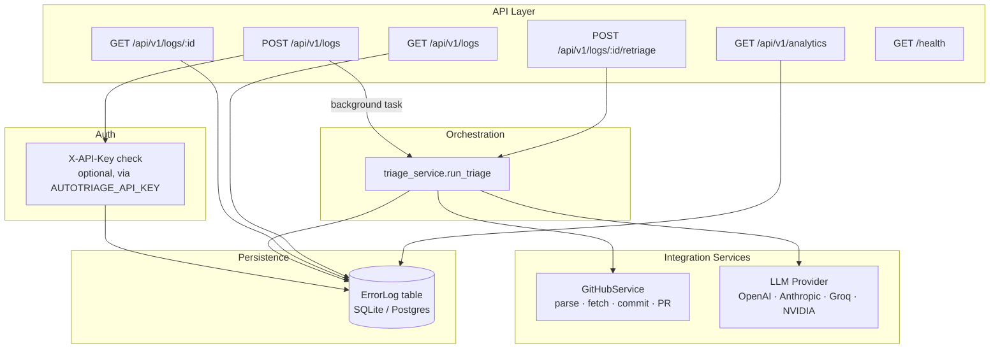
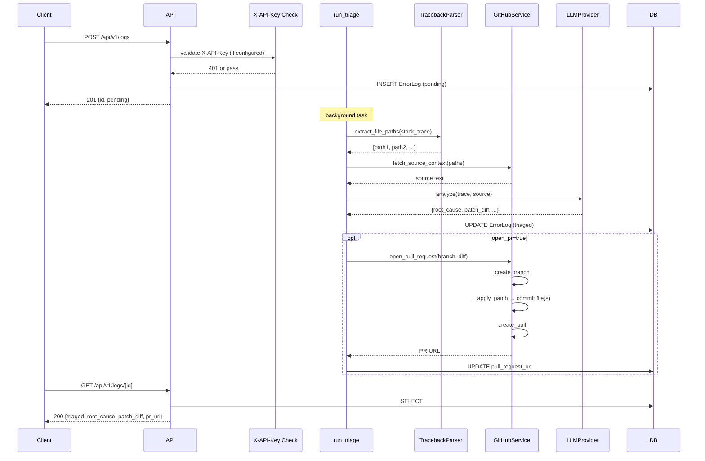

# Architecture

## Overview

AutoTriage is a single FastAPI service organized into five layers: API routes, orchestration, integration services, analytics, and persistence. Each error log passes through the same pipeline: ingest → parse trace → correlate with source → analyze with LLM → generate fix → (optionally) commit patch and open PR.



## Component Responsibilities

### API Layer (`app/api/`)

- **`logs.py`** — four log endpoints. Ingestion is deliberately thin: validate the payload (+ optional API key check), persist, schedule background triage, return immediately. This keeps `POST /logs` fast regardless of LLM latency.
- **`analytics.py`** — `GET /api/v1/analytics`. Aggregates across all persisted logs: status breakdown, per-service counts, top affected files, recurring root causes, per-service error rates. All aggregation is done in Python rather than raw SQL for readability and testability.
- **`health.py`** — liveness/config-check endpoint. Reports active LLM provider and whether GitHub is configured, without exposing secret values.

### Auth (`app/api/logs.py` → `_require_api_key`)

When `AUTOTRIAGE_API_KEY` is set in the environment, `POST /api/v1/logs` requires an `X-API-Key` header matching that value. When the variable is unset the endpoint is open (development / internal-only mode). Implemented as a FastAPI `Depends` function so it can be applied per-route and is easy to test in isolation.

### Orchestration (`app/services/triage_service.py`)

`run_triage` is the single entry point that drives a log through the full pipeline:

1. Extract file paths from the stack trace
2. Fetch source context from GitHub
3. Call the LLM
4. Persist results
5. Optionally commit the patch diff and open a PR

Centralizing this in one function means both the background-task path (`POST /logs`) and the synchronous retriage path (`POST /logs/:id/retriage`) share identical behavior.

### GitHub Integration (`app/services/github_service.py`)

Three responsibilities kept in one class (shared authenticated client):

1. **Parse** — structured, language-specific traceback parsing:
   - **Python** — matches `File "path.py", line N` (standard `traceback` format)
   - **Node/JS/TS** — matches `at FunctionName (file.js:line:col)` and `at file.js:line:col` (V8 format); handles `.js`, `.ts`, `.mjs`, `.cjs`
   - **Java** — matches `at com.example.Class.method(File.java:line)` and converts FQCN to a probable file path
   - **Generic fallback** — file-extension regex for Go, Ruby, and other languages
   - Each parser is tried in order; the first one that returns results wins. All results are deduplicated while preserving order.

2. **Fetch** — pull file contents from the configured GitHub repo to give the LLM real source context.

3. **Write** — when `open_pr=true` and a patch diff is available:
   - Create a new branch off `main` (or configured base)
   - Parse the unified diff from the LLM response using `_split_diff_by_file` and `_apply_hunks`
   - Commit each changed file to the branch via the GitHub Contents API (create or update as needed)
   - Open a pull request with committed files listed in the body

   The diff parser handles the subset of unified diff LLMs reliably produce: `---`/`+++` headers with optional `a/`/`b/` prefixes, `@@ -N,M +N,M @@` hunk headers, and `+`/`-`/` ` (context) lines. Non-parseable diffs fall back to a PR shell with the patch in the description — triage is never blocked by a bad diff.

   The service degrades gracefully when unconfigured: all parsing still works, source fetch returns a placeholder, and write operations raise `GitHubServiceError` rather than silently failing.

### LLM Provider (`app/services/llm_provider.py`)

An abstract `BaseLLMProvider` with `OpenAIProvider` and `AnthropicProvider` implementations, selected via `LLM_PROVIDER`. Both use the same system prompt and must return the same JSON contract:

```json
{
  "root_cause": "...",
  "affected_files": ["path/to/file.py"],
  "confidence": "low|medium|high",
  "suggested_fix": "...",
  "patch_diff": "unified diff or null"
}
```

`OpenAIProvider` accepts an optional `base_url`, making Groq (`https://api.groq.com/openai/v1`) and NVIDIA NIM (`https://integrate.api.nvidia.com/v1`) drop-in replacements with no code changes — just set `LLM_PROVIDER=openai`, `LLM_API_KEY=<key>`, and `OPENAI_API_BASE=<url>`.

Response parsing strips markdown fences that some models wrap JSON in.

### Persistence (`app/models/`)

- **`error_log.py`** — the SQLAlchemy `ErrorLog` model. One row per ingested error, carrying both the original log data and (once processed) the triage results. Status transitions: `pending → analyzing → triaged | failed`.
- **`schemas.py`** — Pydantic v2 request/response schemas, kept separate from the ORM model so the API contract can evolve independently of the storage schema.

## Key Design Decisions

**Why agentless?** Installing an SDK or sidecar in every service that might error is a real integration cost. A single REST endpoint means any service that can make an HTTP call — regardless of language or framework — can report into AutoTriage with no library dependency.

**Why user-supplied LLM keys?** AutoTriage doesn't want to be a billing intermediary or a rate-limit bottleneck. Callers use their own account; cost and quota are theirs to control. AutoTriage stays a thin orchestration layer rather than a paid proxy.

**Why structured language parsers instead of a single regex?** The original implementation used a single permissive regex. While simple, it produces false positives on log messages that look like paths, misses Node's `at file:line:col` format entirely, and can't reconstruct Java file paths from FQCNs. The replacement uses dedicated parsers per language, tried in order, with the generic regex as a final fallback. Each parser is independently testable.

**Why commit the patch before opening the PR?** A PR that only contains a diff in its description body is hard to review and impossible to merge as-is. Committing the actual file changes means the PR has a real diff view, can be merged by a reviewer with one click, and triggers CI on the branch automatically.

**Why optional API key auth?** For internal tooling and local development, open ingestion reduces friction. For production deployments, a single shared key on the ingestion endpoint is sufficient to prevent unauthorized submissions. The `AUTOTRIAGE_API_KEY` env var toggles it cleanly without code changes.

**Why background tasks instead of a queue (e.g. Celery/Redis)?** For the current scale, FastAPI's `BackgroundTasks` avoids standing up a broker while still keeping ingestion fast. It's a known limitation (see below).

**Why SQLite by default?** Zero setup for local development and CI. `DATABASE_URL` is the only thing that changes for Postgres in production — no code changes required.

## Known Constraints

- **In-process background tasks** — a crashed server loses any in-flight triage not yet persisted as failed. The natural upgrade is Celery + Redis (or RQ): replace `background_tasks.add_task(run_triage, ...)` with a task queue enqueue, and workers pick up the job durably.
- **Patch application scope** — the diff parser handles the well-formed unified diffs LLMs reliably produce. Heavily context-dependent diffs (large files, complex merges) may partially apply or fall back to a PR shell. A future improvement would run the patch through `git apply --check` before committing.
- **Traceback coverage** — Python, Node/JS/TS, and Java are explicitly handled. Go, Ruby, Rust, and others fall back to the generic file-extension regex, which trades precision for coverage.
- **No frontend** — the API is fully functional but has no dashboard UI. A React + Vite + Tailwind frontend (error list, drill-down, retriage button) is the logical next step.
- **Single-tenant auth** — the current `X-API-Key` check is a single shared secret. A multi-tenant deployment would need per-service keys, JWT, or an API gateway layer.

## Data Flow Diagram


