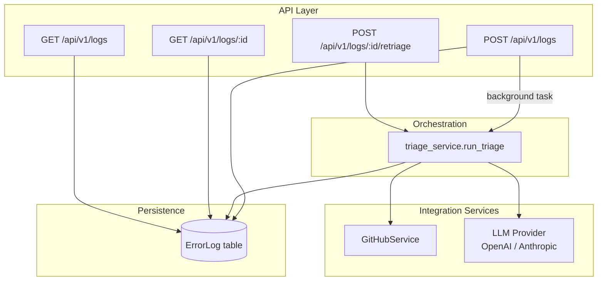

# Architecture

## Overview

AutoTriage is a single FastAPI service organized into four layers: API routes, orchestration, integration services, and persistence. Each error log passes through the same pipeline: ingest → correlate with source → analyze with an LLM → generate a fix → (optionally) open a PR.

## Component Responsibilities

### API Layer (`app/api/`)

- `logs.py` — the four log-related endpoints. Ingestion is deliberately thin: validate the payload, persist it, schedule triage as a background task, and return immediately. This keeps the ingestion endpoint fast regardless of how long the LLM call takes.
- `health.py` — a liveness/config-check endpoint used for monitoring and for confirming GitHub/LLM configuration without exposing secrets.

### Orchestration (`app/services/triage_service.py`)

`run_triage` is the single entry point that drives a log through the full pipeline: extract file paths from the stack trace, fetch source context from GitHub, call the LLM, persist results, and optionally open a PR. Centralizing this in one function (rather than spreading the logic across endpoints) means both the background-task path (`POST /logs`) and the synchronous retriage path (`POST /logs/:id/retriage`) share identical behavior.

### GitHub Integration (`app/services/github_service.py`)

Two responsibilities, kept in one class since they share the same authenticated client:

1. **Read** — extract candidate file paths from a raw stack trace via regex, then fetch their contents from the configured repo to give the LLM real source context instead of guessing from the trace alone.
2. **Write** — open a branch and pull request once a patch is generated.

The service degrades gracefully when unconfigured (no token/repo set): `extract_file_paths` still works on the raw trace, and `fetch_source_context` returns a placeholder string rather than raising, so triage still produces a best-effort root-cause analysis without GitHub access.

### LLM Provider (`app/services/llm_provider.py`)

An abstract `BaseLLMProvider` with `OpenAIProvider` and `AnthropicProvider` implementations, selected via `LLM_PROVIDER`. Both are called with the same system prompt and must return the same JSON contract (`root_cause`, `affected_files`, `confidence`, `suggested_fix`, `patch_diff`), so the rest of the pipeline never branches on which provider is active. Response parsing tolerates markdown code fences some models wrap JSON in.

### Persistence (`app/models/`)

- `error_log.py` — the SQLAlchemy `ErrorLog` model. One row per ingested error, carrying both the original log data and (once processed) the triage results. Status moves through `pending → analyzing → triaged | failed`.
- `schemas.py` — Pydantic request/response schemas, kept separate from the ORM model so the API contract can evolve independently of the storage schema.

## Key Design Decisions

**Why agentless?** Installing an SDK or sidecar in every service that might error is a real integration cost, and it's the reason teams delay adopting observability tooling. A single REST endpoint means any service that can make an HTTP call — regardless of language or framework — can report into AutoTriage with no library dependency.

**Why user-supplied LLM keys?** AutoTriage doesn't want to be a billing intermediary or a rate-limit bottleneck for LLM calls. Callers use their own OpenAI/Anthropic account, so cost and quota are theirs to control directly, and AutoTriage stays a thin orchestration layer rather than a paid proxy.

**Why background tasks instead of a queue (e.g. Celery/Redis)?** For the scope of a hackathon-stage build, FastAPI's built-in `BackgroundTasks` avoids standing up a broker while still keeping the ingestion endpoint fast. It's a known limitation (see below) and the natural next step if throughput requirements grow.

**Why regex-based file extraction instead of parsing structured tracebacks per language?** Stack traces vary significantly across Python, Node, Java, Go, etc. A single permissive regex over common source file extensions is intentionally simple and language-agnostic; it trades precision for coverage, and the LLM is given the benefit of the doubt to ignore irrelevant matches.

**Why SQLite by default?** Zero setup for local development and CI. `DATABASE_URL` is the only thing that changes to point at Postgres in production — no code changes required since SQLAlchemy abstracts the dialect.

## Known Constraints

- Background tasks run in-process; a crashed server loses any in-flight triage (not yet persisted as failed). A production deployment would move this to a durable queue.
- PR creation assumes the patch can be applied as a new branch off `main`; it does not currently handle merge conflicts or apply the diff itself — branch and PR shell are created, and the diff is included in the PR body/description for review.
- File-path extraction is regex-based and may miss traces that don't include a recognizable file extension, or may pick up false positives from log messages that happen to look like paths.
